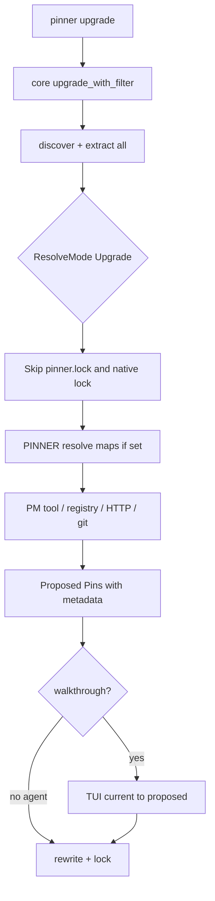

# Upgrade Subcommand Design

**Date:** 2026-08-05  
**Status:** Approved for implementation planning  
**Summary:** Add an opt-in `pinner upgrade` command that re-resolves declared dependencies to the newest available versions per ecosystem (via package managers, registries, or other means), then reuses pin’s rewrite → lock → walkthrough/agent path with a side-by-side upgrade TUI.

## Problem

`pinner pin` freezes floating refs and then prefers `pinner.lock.json` / native locks, so a second pin is idempotent and will not bump already-exact pins. Teams still need a deliberate, reviewable way to move libraries, binaries, images, and modules to the **most recent** versions across ecosystems — without learning each package manager’s upgrade UX.

Pinner should eat that complexity: one optional subcommand, per-provider upgrade strategies (prefer Rust-based tools like `uv` where applicable), the same walkthrough/agent contract as pin, and clear documentation of what each provider supports.

## Goals

1. **Opt-in upgrade CLI:** `pinner upgrade` — never implied by `check` or CI; humans/agents must invoke it.
2. **Latest-by-default policy:** resolve to the newest available version/digest/SHA appropriate for each ecosystem (including major bumps). Walkthrough accept/skip/edit is the safety valve.
3. **Same write path as pin:** rewrite manifests → regenerate `pinner.lock.json`; honor `--dry-run`, `--ecosystem`, `--offline`, `--walkthrough`, `--agent` / `--format json`.
4. **Side-by-side review:** walkthrough shows current pin → proposed upgrade (not only requested → proposed).
5. **Per-provider upgrade means:** each ecosystem declares preferred tool(s) and fallback channels (HTTP/registry/git); prefer Rust-based PMs (`uv`) when choosing among peers.
6. **Documented support matrix:** root `README.md` plus per-provider pages under `docs/guide/ecosystems/`.
7. **Install docs via mise:** document `cargo:` and `github:` backends as the supported mise install targets for Pinner itself.

### Non-goals

- Replacing Renovate/Dependabot or opening PRs.
- Constrained upgrades by default (`--semver patch|minor|major` may be a later flag; v1 is latest-only).
- Guaranteeing post-upgrade build/test success.
- Upgrading path/git/VCS/local module sources (same skips as pin).
- Changing `pinner check` semantics (still drift vs committed lock).

## Decisions

| Topic | Choice |
|-------|--------|
| Command name | `pinner upgrade` |
| Default version policy | **Latest available** (majors allowed) |
| Candidates | All upgradeable declared deps from `extract` (floating **and** exact), minus pin’s existing skips (path/git/VCS/local) |
| Lock preference | **Bypass** `pinner.lock.json` and native locks for upgrade resolve; test seams via `PINNER_*_RESOLVE_MAP` still win when set |
| Architecture | `ResolveMode::{Pin, Upgrade}` on `EcosystemCtx` + `upgrade` / `upgrade_with_filter` in core sharing pin’s rewrite/lock pipeline |
| Offline | Fail closed unless resolve map supplies every candidate (same exit `2` contract) |
| Walkthrough | Same accept/skip/edit/quit; columns show **current → proposed** |
| Agent mode | Same as pin: JSON, no prompts; `--walkthrough` + agent/non-TTY → exit `2` |
| Docs | README matrix + `docs/guide/ecosystems/<kind>.md` for every `EcosystemKind` |
| mise install of Pinner | Document `cargo:pinner` and `github:zloeber/Pinner` backends (not a vague `mise install pinner`) |

## Approaches considered

### A — Separate `Upgrade` trait method per ecosystem (rejected)

Add `fn upgrade_resolve(...)` beside `resolve`. Clear intent, but doubles every crate’s surface and duplicates rewrite/lock orchestration.

### B — Fork orchestration only; hack resolve with empty lock (rejected)

Call existing `resolve` with `lock_pins: &[]` and somehow ignore native locks. Brittle: many crates still short-circuit on native locks / treat exact requested as already resolved.

### C — `ResolveMode` on context + shared upgrade orchestration (**chosen**)

Extend `EcosystemCtx` with `resolve_mode`. Ecosystems branch at the top of resolve: Upgrade skips freeze evidence and runs “newest” strategies. Core adds `upgrade` / `upgrade_with_filter` that select all upgradeable findings and reuse pin’s staging/rewrite/lock/walkthrough hooks.

**Why C:** Minimal CLI/core duplication, one evidence model, testable mode flag, incremental per-ecosystem enablement.

## Architecture

```text
pinner upgrade [--walkthrough|--agent|…]
    → core::upgrade_with_filter
         discover / extract (all findings)
         filter upgradeable (!skipped kinds; respect allow_floating? no — upgrades still apply)
         ecosystem.resolve(findings, ctx with ResolveMode::Upgrade)
         walkthrough filter (optional)
         rewrite + write pinner.lock.json   # same as pin
```



### EcosystemCtx

```rust
pub enum ResolveMode {
    Pin,
    Upgrade,
}

pub struct EcosystemCtx<'a> {
    pub repo: &'a Path,
    pub lock_pins: &'a [Pin],
    pub offline: bool,
    pub pin_exact_ranges: bool,
    pub resolve_mode: ResolveMode,
}
```

- **Pin mode:** unchanged order — lock → native lock → map → tool/registry → fail.
- **Upgrade mode:** map (test/offline seam) → tool/registry/HTTP/git “latest” → fail. Do **not** return existing lock/native versions unless they are already newest (optional short-circuit after fetching latest: if equal, omit from proposed set or include with `unchanged` metadata — **v1 omits unchanged** so walkthrough only shows real bumps).

### Pin metadata (upgrade)

When proposing a bump, set:

| Key | Value |
|-----|-------|
| `upgrade` | `true` |
| `previous` | prior exact pin / declared exact / prior digest-or-SHA string shown as “current” |
| `upgrade_channel` | `"tool"` \| `"registry"` \| `"http"` \| `"git"` \| `"map"` |

`requested` remains the manifest’s declared constraint/version. `pinned` is the new target. Walkthrough displays `previous → pinned` when `upgrade` is true, else `requested → pinned`.

### Core orchestration

Mirror `pin` / `pin_with_filter`:

- `upgrade` / `upgrade_with_filter` in [`crates/pinner-core/src/orchestrate.rs`](../../../crates/pinner-core/src/orchestrate.rs)
- Candidate set: all extracted findings that are upgradeable (not path/git/VCS/local — ecosystems already omit those in extract; allowlisted floating refs are still upgradeable unless we later add `upgrade.ignore`)
- Empty proposed set (everything already latest) → success, no writes (or rewrite lock timestamps only — **v1: no writes**, report `upgraded: 0`)
- Walkthrough abort → exit `0`, nothing written

### CLI

| Surface | Behavior |
|---------|----------|
| `pinner upgrade` | Run upgrade orchestration |
| Global flags | Same as pin: `--dry-run`, `--offline`, `--ecosystem`, `--config`, `--format`, `--walkthrough`, `--agent` |
| Exit codes | `0` ok/abort-clean/no-op; `1` unused for upgrade success path (no “drift”); `2` tool/config/resolve/invalid mode |

`check` / `pin` / `audit` unchanged.

### TUI

Extend [`crates/pinner-ui/src/walkthrough.rs`](../../../crates/pinner-ui/src/walkthrough.rs):

- Column title: `current → proposed` when any pin has `metadata.upgrade == true`, else keep `requested → proposed`.
- Cell text: `previous → pinned` for upgrades; `requested → pinned` otherwise.
- Optional header subtitle: `upgrade review` when in upgrade mode (pass a `WalkthroughKind` or detect via metadata).
- Keys unchanged: accept / skip / edit / quit.

### Toolchain

Extend `required_tools` for upgrade-capable ecosystems that need CLIs (cargo online resolve may need `cargo` or HTTP; go may need `go`; ruby may use HTTP or `gem`). Prefer:

| Ecosystem | Preferred upgrade tool | Fallbacks |
|-----------|------------------------|-----------|
| python | **uv** | resolve map |
| node | npm (`npm view`); detect pnpm/yarn locks for rewrite context only | resolve map |
| mise | **mise** (`mise latest` / `ls-remote`) | resolve map |
| cargo | crates.io HTTP (Rust, no extra PM) or `cargo search`/`cargo info` if present | resolve map |
| go | `go list -m -u` when `go` present | proxy.golang.org HTTP; map |
| ruby | RubyGems HTTP (no Bundler required); `gem` optional | map |
| docker / k8s / gitlab images / actions images | docker buildx digests for **latest** tag or retarget digest for same floating tag policy: upgrade retags mutable tags to fresh digest; exact digest pins re-resolve via tag in metadata if present else skip | map |
| actions (uses) | `gh api` → default branch / latest release SHA per policy: **latest release tag’s commit**, else default branch HEAD | map |
| terraform | registry HTTP latest matching *unconstrained* latest version (not `~>` floor) | git `ls-remote` for git modules; map |
| helm | repo/OCI latest chart version | map |
| azure tasks | marketplace/version API or map-only until HTTP exists | map |
| gitlab includes | `git ls-remote` HEAD/default | map |

Exact command strings are owned by each crate and listed in per-provider docs.

## Per-provider support matrix (normative)

Document this table on the root README and expand each row in `docs/guide/ecosystems/<kind>.md`.

| Provider | Default | Preferred upgrade means | Also supported | Upgrade pin style | Notes |
|----------|---------|-------------------------|----------------|-------------------|-------|
| mise | on | `mise latest` / `mise ls-remote` | `PINNER_MISE_RESOLVE_MAP` | exact tool version | Nested mise configs included |
| node | on | `npm view <pkg> version` | native lock ignored in upgrade; map | exact version in package.json | Workspaces supported |
| python | on | **`uv pip compile`** / uv resolve | poetry/pdm locks ignored in upgrade; map | exact `==` | Prefer uv over pip/poetry CLI |
| docker | on | `docker buildx imagetools inspect` | local inspect; map | `name@sha256:…` | Upgrades digest for image reference |
| actions | on | `gh api` (latest release → SHA) | docker digests for workflow images; map | `@<sha>` + image digests | Reusable/composite uses included |
| terraform | on | registry HTTP latest version | `git ls-remote`; `.terraform.lock.hcl` ignored in upgrade; map | exact version / full SHA | Local modules skipped |
| helm | opt-in | HTTP index / OCI tags latest | docker digests for values images; map | exact chart ver / image digest | Requires `helm = true` |
| k8s | opt-in | docker digests | map | image digest | Workload kinds only |
| cargo | on | crates.io HTTP API | `cargo` CLI if used; map | exact semver in Cargo.toml | Path/git deps skipped |
| go | on | `go list -m -u` | proxy.golang.org; map | exact module version | |
| ruby | on | RubyGems HTTP | `gem` optional; map | exact gem version | |
| gitlab | opt-in | docker digests + `git ls-remote` | map | digest / SHA | Opt-in in pinner.toml |
| azure | opt-in | docker digests; task versions via map/HTTP | map | digest / exact task ver | Opt-in |

### Support levels (for docs)

Each provider page must state:

1. **Pin** — freeze floating → exact (existing).
2. **Upgrade** — bump to latest (this feature): tools + fallbacks.
3. **Check** — drift vs `pinner.lock.json` (unchanged).
4. **Gaps** — what is not upgraded (path deps, etc.).

## Install via mise (Pinner itself)

README Install section must replace vague `mise install pinner` with explicit backends:

```bash
# GitHub release backend (prebuilt)
mise use -g github:zloeber/Pinner

# Cargo backend (build from crates.io / git as configured)
mise use -g cargo:pinner
```

Document that backend availability depends on mise version and published package name; curl installer and `cargo install` remain first-class.

## Config

Optional future `[upgrade]` table is **out of scope for v1**. No new required `pinner.toml` keys. Ecosystems still gated by existing `[ecosystems]` enable flags; `--ecosystem` filters enabled kinds only.

## Errors and testing

- Resolution failure → exit `2` with ecosystem, name, requested, hint (same as pin).
- `--offline` without maps → fail closed.
- Unit tests: `ResolveMode::Upgrade` bypasses lock fixtures; use resolve maps.
- Integration: fixture with exact pins → upgrade proposes newer map/network versions → walkthrough skip leaves file unchanged; accept rewrites.
- CLI smoke: `upgrade --agent`, `upgrade --walkthrough --agent` → exit `2`.
- Idempotency: upgrade when already latest → `upgraded: 0`, no diff.

## Documentation deliverables

| Artifact | Change |
|----------|--------|
| [`README.md`](../../../README.md) | Upgrade quick-start; full provider×PM matrix; mise `cargo:` / `github:` install |
| [`docs/guide/quick-start.md`](../../guide/quick-start.md) | Add `pinner upgrade` (+ walkthrough) |
| [`docs/guide/configuration.md`](../../guide/configuration.md) | Note upgrade uses same globals; no new config keys in v1 |
| `docs/guide/ecosystems/*.md` | One page per provider (13) |
| [`docs/SUMMARY.md`](../../SUMMARY.md) | Link ecosystem pages + this spec |
| [`skills/pinner/SKILL.md`](../../../skills/pinner/SKILL.md) | Agent playbook: upgrade vs pin |

## Success criteria

- `pinner upgrade` bumps exact pins to newer versions when evidence exists.
- Walkthrough shows current → proposed and can skip/edit per row.
- `--agent` upgrade emits JSON and writes only when not dry-run.
- README matrix and all 13 provider pages list preferred PM/channel.
- mise install docs mention only `github:zloeber/Pinner` and `cargo:pinner` as mise backends.
- `scripts/ci-local` green after implementation.

## Implementation plan

See [`docs/superpowers/plans/2026-08-05-upgrade-subcommand.md`](../plans/2026-08-05-upgrade-subcommand.md).
